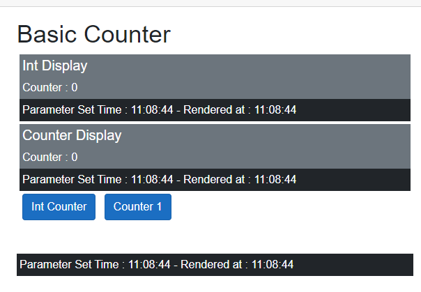

# Exploring Component Rendering

Blazor ships with a single developer "Component".  If you add a Razor file it inherits from it by default.

`ComponentBase` rules the Blazor UI world.  You don't have to use it, but probably 99.x% of all developer built components either inherit directly or indirectly from it.

This article explores the render processa of components that inherit from `ComponentBase`.  You can find another article here that looks at building alternative leaner and meaner base components.

The context for this article is the out-of-the-box `Counter` page.  We examine how, why and when rendering occurs, and strategies to take greater control of the process.

Why should we worry?  

1. The Render process is expensive.  Every time a component's parameters are set:
   - The parameter setting process uses Reflection to assign new values to the component parameters.
   - Several Task state machines are created and destroyed, often to do nothing. 

2. In server mode. whether you pay for cycles, or assign resources to containers or virtual machines it matters.

3. In WASM mode it affects performance.

4. It can affect you coding decisions.  How many components do I have in this page, will it affect the UX?  Should I revert to repetitive html code for performance? 

## The Render Cascade

It's easier to demonstrate this that describe it in detail.

First an object to hold our data.  Why this is a record rather than a class will become evident later.  And yes, in this instance why do we need an object, we only have one piece of data.  True, but not often the case in real life.

```csharp
public record CounterData(int Counter);
```
### Displaying Component Lifefcycle Information 

Some Debug code for each component to capture the time when the component's parameters are updated and when a request is made to render.

The code:

1. `ParameterSetTime` is captured by overriding `SetParametersAsync` and logging the time.
2. Parameter Render request time is set by overriding `ShouldRender` and logging the time the method is called.  `ShouldRender` is not called on the first render, so we override `OnInitializedAsync` and add the yielding `Task.Delay` to cause a double render: once on the yield and second when the await completes.

```csharp
private string ParameterSetTime = string.Empty;
private string RenderTime = string.Empty;
    
public override Task SetParametersAsync(ParameterView parameters)
{
    // set the parameters
    parameters.SetParameterProperties(this);
    // log the time
    this.ParameterSetTime = DateTime.Now.ToLongTimeString();
    // run the component lifecycle
    return base.SetParametersAsync(ParameterView.Empty);
}

protected override Task OnInitializedAsync()
    => Task.Delay(1);

protected override bool ShouldRender()
{
    this.RenderTime = DateTime.Now.ToLongTimeString();
    return base.ShouldRender();
}
```

This UI code displays the times:

```csharp
<div class="bg-dark text-white p-1 m-1 mt-0">
    Parameter Set Time : @this.ParameterSetTime  -  Rendered at : @this.RenderTime
</div>
```

Two components:

#### IntDisplay

Displays the counter passed as a `int` into the component

```caharp
<div class="bg-secondary text-white m-1 mb-0 p-1">
    <h5>@this.Title</h5>
    <div>Counter : @Data </div>
</div>
<div class="bg-dark text-white p-1 m-1 mt-0">
    Parameter Set Time : @this.ParameterSetTime  -  Rendered at : @this.RenderTime
</div>


@code {
    [Parameter, EditorRequired] public int Data { get; set; } = 0;
    [Parameter] public string Title { get; set; } = "Int Display";

    private string ParameterSetTime = string.Empty;
    private string RenderTime = string.Empty;

    public override Task SetParametersAsync(ParameterView parameters)
    {
        parameters.SetParameterProperties(this);
        this.ParameterSetTime = DateTime.Now.ToLongTimeString();
        return base.SetParametersAsync(ParameterView.Empty);
    }

    protected override Task OnInitializedAsync()
        => Task.Delay(1);

    protected override bool ShouldRender()
    {
        this.RenderTime = DateTime.Now.ToLongTimeString();
        return base.ShouldRender();
    }
}
```

#### BasicCounterDisplay

Displays the counter passed as a `CounterData` object. 

```csharp
<div class="bg-secondary text-white m-1 mb-0 p-1">
    <h5>@this.Title</h5>
    <div>Counter : @this.Data.Counter </div>
</div>
<div class="bg-dark text-white p-1 m-1 mt-0">
    Parameter Set Time : @this.ParameterSetTime  -  Rendered at : @this.RenderTime
</div>


@code {
    [Parameter, EditorRequired] public CounterData Data { get; set; } = new(Counter: 0);
    [Parameter] public string Title { get; set; } = "Counter Display";

    private string ParameterSetTime = string.Empty;
    private string RenderTime = string.Empty;

    protected override Task OnInitializedAsync()
        => Task.Delay(1);

    public override Task SetParametersAsync(ParameterView parameters)
    {
        parameters.SetParameterProperties(this);
        this.ParameterSetTime = DateTime.Now.ToLongTimeString();
        return base.SetParametersAsync(ParameterView.Empty);
    }

    protected override bool ShouldRender()
    {
        this.RenderTime = DateTime.Now.ToLongTimeString();
        return true;
    }
}
```
#### Counter

Our new `Counter` component:

```csharp
@page "/c1"
<PageTitle>Counter</PageTitle>

<h1>Basic Counter</h1>

<IntDisplay Data=this.currentCount />
<BasicCounterDisplay Data=this.data />

<button class="btn btn-primary ms-2 me-2" @onclick="IncrementCount">Int Counter</button>
<button class="btn btn-primary me-2" @onclick="IncrementCount1">Counter 1</button>

<div class="bg-dark text-white p-1 mt-5">
    Parameter Set Time : @this.ParameterSetTime  -  Rendered at : @this.RenderTime
</div>


@code {
    private int currentCount = 0;
    private CounterData data = new(Counter: 0);

    private void IncrementCount()
        => currentCount++;

    private void IncrementCount1()
        => data = data with {Counter = data.Counter + 1 };

    private string ParameterSetTime = string.Empty;
    private string RenderTime = string.Empty;
    
    public override Task SetParametersAsync(ParameterView parameters)
    {
        parameters.SetParameterProperties(this);
        this.ParameterSetTime = DateTime.Now.ToLongTimeString();
        return base.SetParametersAsync(ParameterView.Empty);
    }

    protected override bool ShouldRender()
    {
        this.RenderTime = DateTime.Now.ToLongTimeString();
        return base.ShouldRender();
    }
}
```

Run the code you:
1. Everything updates when you click the *Int Counter* 
2. Everything but `Int Display` updates when you click *Counter 1* 



*Counter Display* updates when clicking *Int Counter* are caused by a *Render Cascade* from `Counter`.  The button click is a UI event.  The event handler calls `StateHasChanged` on `Counter` which causes a render.  The Renderer checks if the parameters on any sub-components have changed and calls `SetParametersAsync` on any that have.

The logic used to decide if a parameter has changed is as follows:

```csharp
public static bool MayHaveChanged<T1, T2>(T1 oldValue, T2 newValue)
{
    var oldIsNotNull = oldValue != null;
    var newIsNotNull = newValue != null;

    // Only one is null so different
    if (oldIsNotNull != newIsNotNull)
        return true;

    var oldValueType = oldValue!.GetType();
    var newValueType = newValue!.GetType();

    // HERE
    if (oldValueType != newValueType)
        return true;

    if (!IsKnownImmutableType(oldValueType))
        return true;

    return !oldValue.Equals(newValue);
}

private static bool IsKnownImmutableType(Type type)
    => type.IsPrimitive
        || type == typeof(string)
        || type == typeof(DateTime)
        || type == typeof(Type)
        || type == typeof(decimal)
        || type == typeof(Guid);```
```

At *HERE* the logic has established that both are not null and both are the same type.  The next line the checks if they are immutable types.  If they aren't then `MayHaveChanged` is true and `SetParametersAsync` must be called on the component.

`BasicCounterDisplay` has `CounterData Data` which is not a known immutable type.  So, whenever `BasicCounterType`'s parent renders, it's `SetParametersAsync` method is called.  Part of `SetParametersAsync` logic is to call `StateHasChanged`, so the instance of `BasicCounterDisplay` gets rendered.

`IntDisplay`'s parameters are all immutable types so the Renderer can make valid equality checks and thus a valid decision on calling `SetParametersAsync`. 

This demonstrates the fundimental problem.  Any child component with at least one non-immutable type as a Parameter will always re-render when it's parent renders.

### Render Cascade Solutions

#### No Non-Immutable Types as Parameters

The Draconian solution and seriously limiting.  `ChildContent` is a render fragment, EventCallbacks are delegates.  All are non-immutable objects.

#### Apply Manual Equality Checks to Parameters

Refactor `BasicCounterDisplay`

```csharp
    // private to hoolde the current counterData
    private CounterData? _data;
```

A method to detect parameter change and apply the change.

```csharp
private static bool HasChanged<TType>(ParameterView parameters, ref TType? currentvalue, ref bool trip, string name)
{
    var haveValue = parameters.TryGetValue<TType>(name, out TType? value);

    if (!haveValue)
        return false;

    var changed = !value?.Equals(currentvalue) ?? currentvalue is not null;

    if (!changed)
        return false;

    currentvalue = value;
    trip = true;
    return true;
}
```

And an updated `SetParametersAsync`

```
public override Task SetParametersAsync(ParameterView parameters)
{
    bool changeTrip = false;

    if (HasChanged(parameters, ref _data, ref changeTrip, "Data"))
        this.Data = _data ?? new(Counter: 0);

    if (!changeTrip)
        return Task.CompletedTask;

    this.ParameterSetTime = DateTime.Now.ToLongTimeString();
    return base.SetParametersAsync(ParameterView.Empty);
}
```

If you run this you will find that only the correct child component now updates.

This is a programmer intensive methodology: you need to manually write the code.  It's not applicable in all situations, but where you can use it it's very efficient compared with the standard method used bt `ComponentBase`.

A variant of this technique is to define all the parameters a component needs in a component specific record and then define a single record parameter.

#### Only Update on Changes

The current models use parameter changes as a proxy for state change.  `MayHaveChanged` is not exactly binary!


## Appendix


