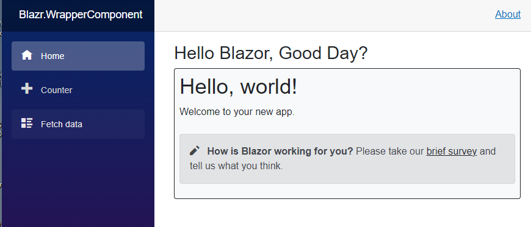

# A Blazor Wrapper Component

Building wrapper components within the current Blazor Framework isn't easy.  

You have two options:

1. Create a very convoluted solution with `ComponentBase`.
2. Build your own base component from the bottom up with the necessary functionality.
 

## Why is it difficult?

`ComponentBase` hardwires the RenderFragment [that represents the component's content] into the render process.

Below are the relevant sections of code from `ComponentBase`. Everything is `private` and `_content` is set in the constructor. 

```csharp
private RenderHandle _renderHandle;
private RenderFragment _content;
private bool _renderPending;
private bool _hasNeverRendered = true;

public Component()
{
    _content = (builder) =>
    {
        _renderPending = false;
        _hasNeverRendered = false;
        this.BuildRenderTree(builder);
    };
}

public void Attach(RenderHandle renderHandle)
    => _renderHandle = renderHandle;
```

And `StateHasChanged` renders `_content`.

```csharp
public void StateHasChanged()
{
    //...
    _renderHandle.Render(_content);
}
```

The Razor compiler completes the boxing operation by compiling all the razor content into `BuildRenderTree`.

## Breaking the Stranglehold

You can't get away from rewriting `Component`.  My *Black Box* replacement [`BlazrComponentBase`] is shown in the appendix.

To implement wrappers we need to control the `RenderFragment` used to render the component.

First we define a new `RenderFragment` property that can be overridden.

```csharp
    protected virtual RenderFragment? ComponentRenderFragment { get; set; }
```

And then update the constructor to render this render fragment instead of `BuildRenderTree` if it's not `null`.  

```csharp
public BlazrComponentBase()
{
    _content = (builder) =>
    {
        _renderPending = false;
        _hasNeverRendered = false;
        if (ComponentRenderFragment is not null)
            ComponentRenderFragment.Invoke(builder);
        else
            BuildRenderTree(builder);
    };
}
```

## The Wrapper Base Component

We can now define a `WrapperComponentBase`.  We set `Content` in the constructor so it's only assigned once.

```
public class WrapperComponentBase : BlazrComponentBase
{
    protected RenderFragment Content { get; set; }

    public WrapperComponentBase() : base() 
    {
        Content = (builder) => this.BuildRenderTree(builder);
    }
}
```

## A Wrapper Component

And build our first wrapper.  The key point to note is that the wrapper content is defined within the `ComponentRenderFragment`, not the main body.

```
@inherits WrapperComponentBase

@*
   Any code here is irrelevant
   All Wrapoer code must be defined inside ComponentRenderFragment
*@

@code {

    protected override RenderFragment ComponentRenderFragment => (__builder) =>
    {
        <h2>Hello Blazor, Good Day?</h2>
        <div class="border border-1 border-dark rounded-2 bg-light p-2">
            @this.Content
        </div>
    };
}
```

## Using the Wrapper on Index

Finally, we can apply the wrapper to any component or page by simply inheriting from it.

```csharp
@page "/"
@inherits MyWrapper

<PageTitle>Index</PageTitle>


<h1>Hello, world!</h1>

Welcome to your new app.

<SurveyPrompt Title="How is Blazor working for you?" />
```



## Appendix

The `WrapperComponentBase` class.  It's a black box replacement for `ComponentBase` with the changes discussed above.

```csharp
public class WrapperComponentBase : IComponent, IHandleEvent, IHandleAfterRender
{
    private Guid Uid = Guid.NewGuid();
    private RenderHandle _renderHandle;
    private RenderFragment _content;
    private bool _renderPending;
    private bool _hasNotInitialized = true;
    private bool _hasNeverRendered = true;
    private bool _hasCalledOnAfterRender;

    protected virtual RenderFragment? ComponentRenderFragment { get; set; }

    public WrapperComponentBase()
    {
        _content = (builder) =>
        {
            _renderPending = false;
            _hasNeverRendered = false;
            if (ComponentRenderFragment is not null)
                ComponentRenderFragment.Invoke(builder);
            else
                BuildRenderTree(builder);
        };
    }

    public void Attach(RenderHandle renderHandle)
        => _renderHandle = renderHandle;

    public virtual async Task SetParametersAsync(ParameterView parameters)
    {
        parameters.SetParameterProperties(this);
        await this.ParametersSetAsync();
    }

    protected async Task ParametersSetAsync()
    {
        Task? initTask = null;
        var hasRenderedOnYield = false;

        // If this is the initial call then we need to run the OnInitialized methods
        if (_hasNotInitialized)
        {
            this.OnInitialized();
            initTask = this.OnInitializedAsync();
            hasRenderedOnYield = await this.CheckIfShouldRunStateHasChanged(initTask);
            _hasNotInitialized = false;
        }

        this.OnParametersSet();
        var task = this.OnParametersSetAsync();

        // check if we need to do the render on Yield i.e.
        //  - this is not the initial run or
        //  - OnInitializedAsync did not yield
        var shouldRenderOnYield = initTask is null || !hasRenderedOnYield;

        if (shouldRenderOnYield)
            await this.CheckIfShouldRunStateHasChanged(task);
        else
            await task;

        // run the final state has changed to update the UI.
        this.StateHasChanged();
    }

    protected virtual void OnInitialized() { }

    protected virtual Task OnInitializedAsync() => Task.CompletedTask;

    protected virtual void OnParametersSet() { }

    protected virtual Task OnParametersSetAsync() => Task.CompletedTask;

    protected virtual void OnAfterRender(bool firstRender) { }

    protected virtual Task OnAfterRenderAsync(bool firstRender) => Task.CompletedTask;

    protected virtual void BuildRenderTree(RenderTreeBuilder builder) { }

    protected virtual bool ShouldRender() => true;

    public void StateHasChanged()
    {
        if (_renderPending)
            return;

        var shouldRender = _hasNeverRendered || ShouldRender() || _renderHandle.IsRenderingOnMetadataUpdate;

        if (shouldRender)
        {
            _renderPending = true;
            _renderHandle.Render(_content);
        }
    }

    async Task IHandleEvent.HandleEventAsync(EventCallbackWorkItem item, object? obj)
    {
        var uiTask = item.InvokeAsync(obj);

        await this.CheckIfShouldRunStateHasChanged(uiTask);

        this.StateHasChanged();
    }

    Task IHandleAfterRender.OnAfterRenderAsync()
    {
        var firstRender = !_hasCalledOnAfterRender;
        _hasCalledOnAfterRender = true;

        OnAfterRender(firstRender);

        return OnAfterRenderAsync(firstRender);
    }

    protected async Task<bool> CheckIfShouldRunStateHasChanged(Task task)
    {
        var isCompleted = task.IsCompleted || task.IsCanceled;

        if (!isCompleted)
        {
            this.StateHasChanged();
            await task;
            return true;
        }

        return false;
    }

    protected Task InvokeAsync(Action workItem)
        => _renderHandle.Dispatcher.InvokeAsync(workItem);

    protected Task InvokeAsync(Func<Task> workItem)
        => _renderHandle.Dispatcher.InvokeAsync(workItem);
}
```
